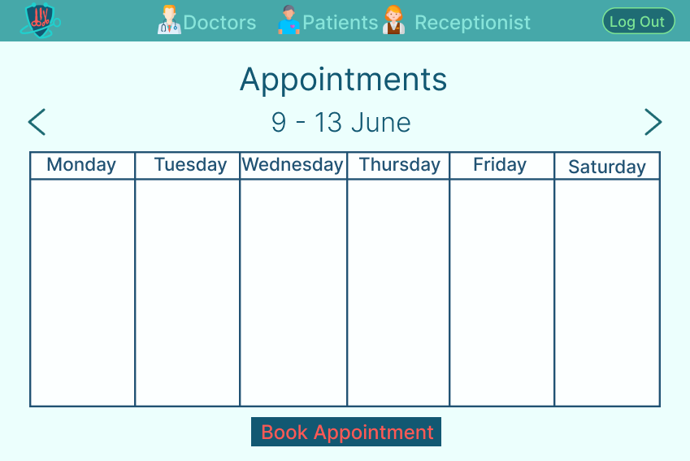
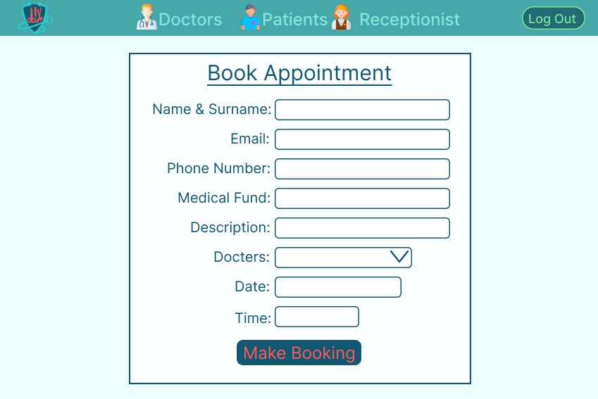
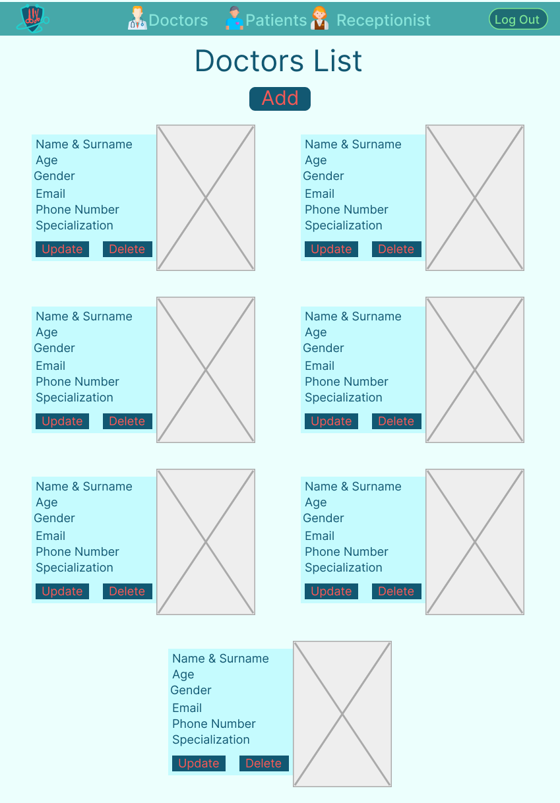
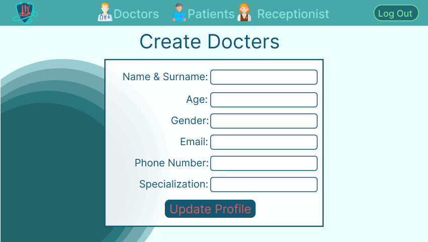
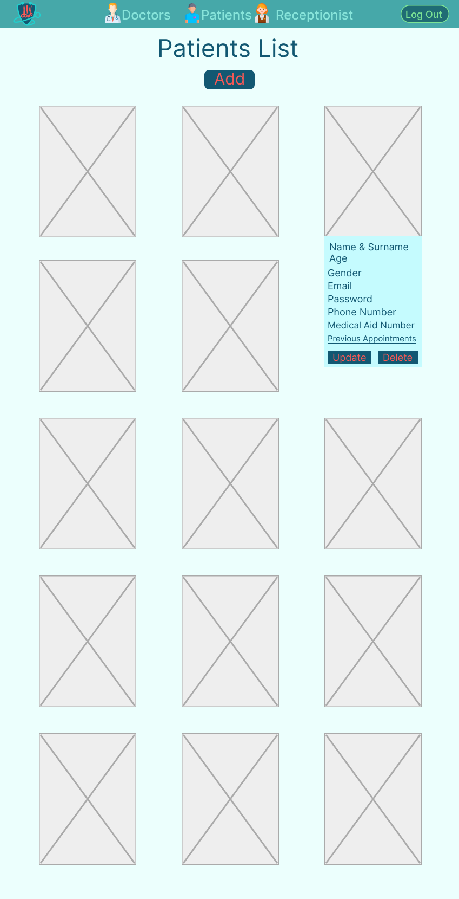
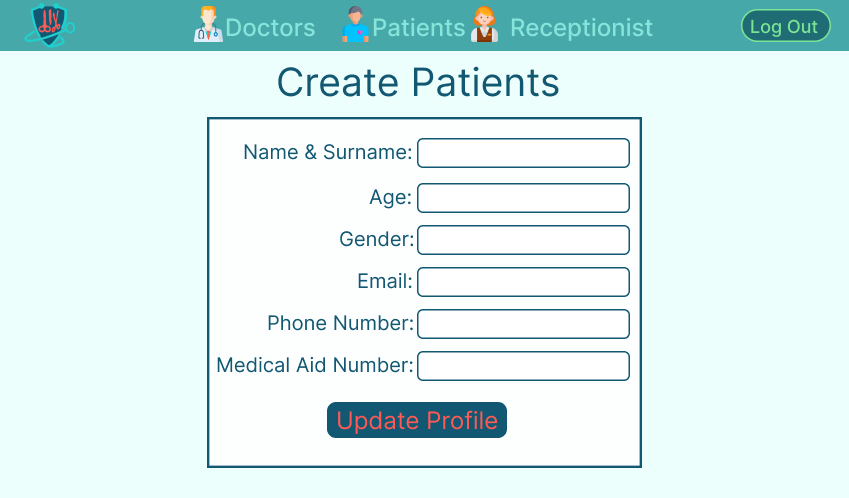
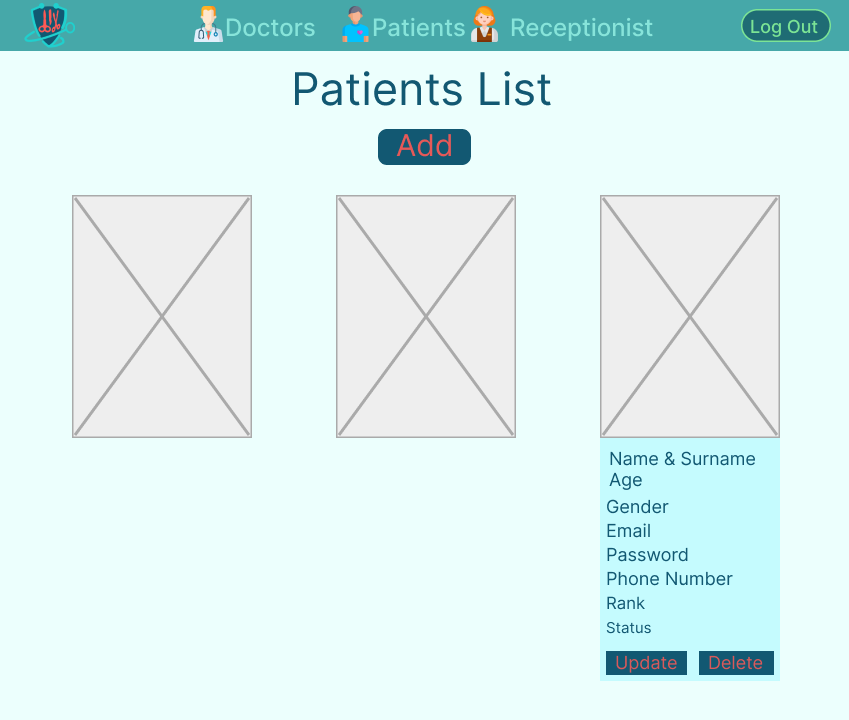
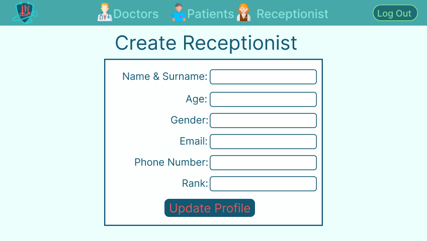

<h5 align="center" style="padding:0;margin:0;">Mariné du Plessis</h5>
<h5 align="center" style="padding:0;margin:0;">221326</h5>
<h6 align="center">DV200 | Term 2</h6>
 

  

<h3 align="center">Medical Office</h3>

  

    This is a website application for a medical practioners office. 

    
    
    ·
    <a href="https://github.com/DupieM/DuPlessisMarine_221326_Final_Project/issues">Report Bug</a>
    ·
    <a href="https://github.com/DupieM/DuPlessisMarine_221326_Final_Project/issues">Request Feature</a>

<!-- TABLE OF CONTENTS -->

## Table of Contents

- [About the Project](#about-the-project)
    - [Project Description](#project-description)
    - [Built With](#built-with)
- [Getting Started](#getting-started)
    - [Prerequisites](#prerequisites)
    - [How to install](#how-to-install)
- [Features and Functionality](#features-and-functionality)
- [Concept Process](#concept-process)
    - [Ideation](#ideation)
    - [Wireframes](#wireframes)
- [Development Process](#development-process)
    - [Implementation Process](#implementation-process)
        - [Highlights](#highlights)
        - [Challenges](#challenges)
    - [Future Implementation](#peer-reviews)
- [Final Outcome](#final-outcome)
    - [Mockups](#mockups)
    - [Video Demonstration](#video-demonstration)
- [Conclusion](#conclusion)

<!--PROJECT DESCRIPTION-->

## About the Project
### Project Description
This term we were tasked to create a persistent data sytem, by developing a management portal for a medical practitioners office.
We needed to develop a website for a medical office which will be used by the practice receptionists. This application will manage Doctors, Patients and their consultations at the practice. 
I chose to do a medical practisioners office that will host surgeons.

### Built With
XAMPP - Cross-Platform, Apache, MySQL, PHP, and Perl
PHP - Hypertext Preprocessor
CSS - Cascading Style Sheet
GitHub - Internet hosting service for software development and version control using GIT
Visual Studio - Integranted Development Enviroment

## Getting Started

These instructions will get you a copy of the project up and running on your local machine for development and testing purposes.

### Prerequisites

For development, the latest version of XAMPP is required. The latest version can be downloaded from [XAMPP](https://www.apachefriends.org/download.html)

### Installation

Clone the project repository as follow:

1.  GitHub Desktop  
    Enter `C:\xampp\htdocs\DuPlessisMarine_221326_Final_Project` into the URL field and press the `Clone` button.

If you require XAMPP do the following steps:

1.  XAMPP  
    Download  the application from here [XAMPP](https://www.apachefriends.org/download.html)

2.  Starting XAMPP  
    Open XAMPP Control bar adn click on start at "Apache" & "MySQL"

3.  Open XAMPP  
    Click on "Admin" next to MYSQL and it will open it up in Michrosoft Edge/ Chrome
    You can then create a database

4. Create folder in XAMPP  
    Open your XAMPP folder in Windows in "C drive" and then open the folder that is labelled "htdocs"
    Then after opening this folder "htdocs" you can create your own folder 

5. Open in Visual Studio code  
    Open your Visual Studio code then click on file and then click on open folder
    Then navigate to where you created your folder in XAMPP and open it

## Features and Functionality
### Log In Page
    I needed to allow at least 3 receptionist with two different types of profiles to log into the management portal. I needed to design it in such way that it must authenticate the email and password against the database.

### Appointment Page
    On this page all the upcoming appointments for a period will be shown. It also needed to contain the primary navigation for the management portal. The primary navigation takes you to either the doctors, patients or receptionist page. On this page a receptionist must view bookings, be able to add a appointment and be able to delete an existing appointment. When you add an appointment you will search for the patient (Name & Surname) where by the patient information will be retrieved and additional fields for the appointment will be displayed.

### Doctors Page
    On this page the profiles of all the registered doctors will be shown. Only the head receptionist will be able to Add a new doctor, Update an existing doctor and be able to Delete a doctor.

### Patients Page
    On this page the profiles of all the registered patients will be shown. Only the head receptionist will be able to Add a new patient, Update an existing patient and be able to Delete a patient.

### Receptionists Page
    On this page the profiles of all the registered receptionists will be shown. Only the head receptionist will be able to Add a new receptionist, Update an existing receptionist and be able to Delete a receptionist. The head receptionist must also be able to Ban a receptionist.

## Concept Process

I went with a simple and minimalistic UI design that fits a medical practioners office. I went with a lot of different shades of blue seeing that doctors are mostly represented by blue and white. For contrast I added a bright red. I aslo decided to use icons that aligns with the theme of the three pages of the doctors, patients and receptionist. I also used icons on the login page that represent doctors. I designed a logo for the medical practioners office as well.

### Wireframes

<!--  -->

## Development Process

The `Development Process` is the technical implementations and functionality done for the website.

### Implementation Process
#### Highlights

The higlight was in researching which types of medical practioners oficces you get and to choose one to use.
Interfacing to a database and seeing data CRUD at work between the application and database was a highlight.

#### Challenges

Some challenges that I faced while doing this project was the code that doesn't let a user that is banned to be able to log in to the management portal. 
Another challenge was to activate success messages for deleting, creating users and also when a patient doesn't exist.

### Future Implementation

Adding success and failure messages right through the application.
Improving on viewing the appointments in a five day table format for the week.

## Final Outcome

### Mockups

![image1][img_part2/mockups/mockup1.jpg]
![image2][img_part2/mockups/mockup2.jpg]
![image3][img_part2/mockups/mockup3.jpg]
![image4][img_part2/mockups/mockup4.jpg]
![image5][img_part2/mockups/mockup5.jpg]
![image6][img_part2/mockups/mockup6.jpg]
![image7][img_part2/mockups/mockup7.jpg]
![image8][img_part2/mockups/mockup8.jpg]
 

### Video Demonstration

[View Demonstration](img_part2/DuPlessisMariné_221326_DV200_Demonstration_Video.mp4)

## Contact
**Mariné du Plessis** - [gmail](mdp.marine@gmail.com)
- **Project Link** - https://github.com/DupieM/DuPlessisMarine_221326_Final_Project